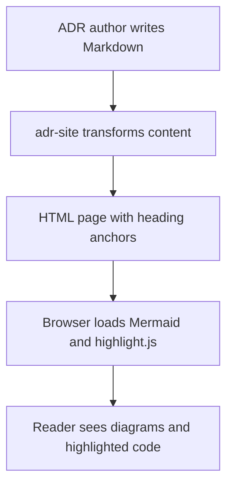

# Show Mermaid and Code Snippets in adr-site

## Context and Problem Statement

The `adr-site` static renderer is used to publish ADRs as browsable HTML. ADRs often benefit from diagrams, code examples, and direct links to specific sections. We also want later ADRs to be able to reference earlier ones such as ADR-000001.

How should the site render diagrams, code snippets, and section-level links while keeping ADR authoring simple?

## Decision Drivers

* Keep authoring in plain Markdown
* Support deep links to specific ADR sections
* Make examples and architecture sketches easy to embed
* Keep the first implementation lightweight

## Considered Options

* Render Mermaid and code highlighting in the browser, and generate heading anchors during rendering
* Render Mermaid and syntax highlighting entirely at build time
* Keep plain Markdown rendering only

## Decision Outcome

Chosen option: "Render Mermaid and code highlighting in the browser, and generate heading anchors during rendering", because it adds visible value quickly without making the site generator significantly more complex.

### Consequences

* Good, because ADR authors can embed Mermaid diagrams with fenced `mermaid` blocks
* Good, because regular fenced code blocks remain natural to write and are syntax highlighted in the browser
* Good, because headings can be linked directly using stable anchors such as `#decision-outcome`
* Good, because later ADRs can reference previous ADRs like ADR-000001 and link to specific sections
* Bad, because Mermaid and syntax highlighting currently depend on browser-side assets

### Confirmation

We confirm this decision by building the site and verifying that diagrams, code snippets, heading links, and ADR references render correctly.

## Pros and Cons of the Options

### Render Mermaid and code highlighting in the browser, and generate heading anchors during rendering

This option keeps the Markdown source simple and moves diagram rendering and syntax highlighting to the browser.

* Good, because the implementation fits well with the current Markdown transformation pipeline
* Good, because the generated HTML remains easy to inspect and debug
* Good, because links like `ADR-000001#decision-outcome` become possible
* Bad, because offline usage may later benefit from bundling assets locally

### Render Mermaid and syntax highlighting entirely at build time

This option would create richer HTML without relying on browser-side rendering.

* Good, because the final site would be more self-contained
* Good, because rendering would be fully deterministic at build time
* Bad, because the implementation is heavier than needed right now
* Bad, because Mermaid build-time rendering adds complexity to a small static site generator

### Keep plain Markdown rendering only

This option keeps the renderer minimal.

* Good, because it is simple to maintain
* Bad, because diagrams and examples become less useful in published ADRs
* Bad, because section-level linking and richer documentation are lost

## More Information

### Reference to a previous ADR

This ADR builds on ADR-000001 and extends the published site so earlier technical decisions can be illustrated and cross-linked more effectively.

### Mermaid example



### Rust code example

```rust
fn render_section_link(id: &str) -> String {
    format!("#{}", id)
}
```

### TOML example

```toml
adr_root = "docs/adr"
template_dir = ".adr/templates"
default_template = "full"
```
