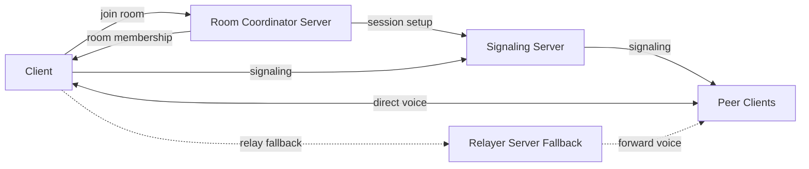
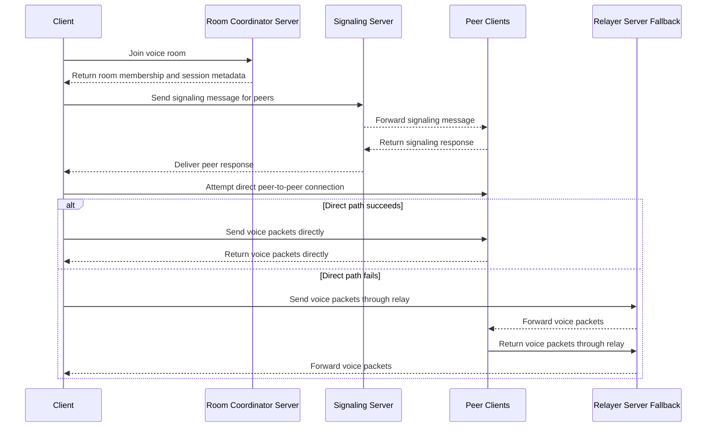

# Voice Chat Architecture for Game Parties

## Context and Problem Statement

We want to add in-game voice chat for game parties of roughly five users. We plan to build on our internal networking libraries, and we need to record the high-level architecture decision before implementation starts.

The main question is how voice media should flow between players. We can either send audio peer-to-peer between party members or route all media through a centralized server. For the initial scope, we care most about supporting small groups well, keeping operational cost reasonable, and preserving a path to evolve the design later if party sizes or product requirements grow.

## Decision Drivers

* Support small game parties of about five users
* Keep end-to-end latency low enough for natural in-game conversation
* Minimize server bandwidth and transfer cost
* Reuse our internal networking stack instead of introducing a separate media platform
* Provide a fallback path when direct peer-to-peer connectivity is not available
* Keep the first version simple enough to ship and learn from
* Preserve the option to move to a more scalable architecture later

## Considered Options

* Peer-to-peer mesh using iroh under the hood, with the game server handling signaling and relay fallback
* SFU with one server handling all media for each party

## Decision Outcome

Chosen option: "Peer-to-peer mesh using iroh under the hood, with the game server handling signaling and relay fallback", because it best fits the initial target of small parties while minimizing server-side media cost and letting us build on internal networking capabilities.

### Consequences

* Good, because small parties of about five users are a reasonable fit for a P2P mesh
* Good, because most media traffic can avoid centralized server egress when direct connectivity succeeds
* Good, because the game server can remain responsible for coordination, signaling, and a relay fallback path instead of acting as the primary media processor
* Good, because using iroh under the hood aligns with our internal networking direction
* Good, because this keeps the first implementation focused on the immediate product need rather than premature large-scale optimization
* Bad, because peer-to-peer connectivity can be less predictable than centralized media routing and depends on NAT traversal success
* Bad, because each client must send and receive multiple audio streams, which becomes less attractive as group size increases
* Bad, because relay fallback still creates server traffic in less favorable network conditions
* Bad, because if we later need larger rooms or more advanced moderation/media controls, we may need to revisit the architecture and introduce an SFU or another centralized approach

### Confirmation

We will confirm this decision by implementing the initial voice-chat path for small parties and validating that:

* parties of about five users can complete voice sessions with acceptable quality and latency
* the game server can successfully handle signaling for session setup
* relay fallback works when direct peer-to-peer connectivity is unavailable
* expected server bandwidth remains materially lower than an equivalent always-on centralized media architecture

## Pros and Cons of the Options

### Peer-to-peer mesh using iroh under the hood, with the game server handling signaling and relay fallback

This option sends audio directly between party members when possible. The game server coordinates session setup and can relay traffic as a fallback when direct connectivity fails.

* Good, because it matches the current product scope of small game parties
* Good, because it reduces the amount of centralized media traffic we need to pay for
* Good, because it can leverage our internal networking libraries and iroh-based connectivity
* Good, because it keeps the server role simpler than a full media-forwarding architecture
* Bad, because connectivity behavior is more dependent on client network conditions
* Bad, because client bandwidth and connection count grow with party size
* Bad, because operational behavior may be more variable than with a centralized SFU

### SFU with one server handling all media for each party

This option routes media through a centralized server that receives audio from each participant and forwards it to the rest of the party.

* Good, because client connectivity is simpler and more predictable
* Good, because it creates a clearer foundation for supporting larger groups in the future
* Good, because centralized media handling can make some diagnostics and controls easier to implement
* Bad, because the server handles all media traffic and increases transfer cost
* Bad, because it introduces more backend infrastructure for the initial small-party use case
* Bad, because it is more architecture than we need for the first version

## More Information

This decision is intentionally scoped to the first version of in-game voice chat for small parties. If future requirements expand toward larger groups, richer moderation features, recording, or more predictable behavior across difficult network environments, we should revisit this ADR and evaluate an SFU or another more scalable topology.

### Required networking components for the P2P mesh

The networking library support for this architecture needs four main components:

* client
* room coordinator server
* signaling server
* relayer server (fallback)

#### Component responsibilities

##### Client

* joins the game party voice room
* obtains room membership and connection metadata
* exchanges signaling messages needed to establish peer connections
* sends and receives voice traffic directly with peers when possible
* falls back to the relayer when a direct peer-to-peer path cannot be established

##### Room coordinator server

* owns room membership and party coordination
* tells clients which peers are in the room
* provides the information needed to start voice-session setup
* coordinates join, leave, and room lifecycle events

##### Signaling server

* forwards connection-setup messages between clients
* helps peers exchange the metadata required to establish direct connectivity
* participates in setup, but is not part of the steady-state voice media path

##### Relayer server (fallback)

* forwards voice packets only when direct peer-to-peer connectivity is unavailable
* provides a degraded-but-working path for difficult network environments
* is intentionally a fallback path rather than the default transport

#### Component view

This simplified view shows one client, the peer clients it needs to talk to, and the three supporting services. The normal voice path is direct to peers. The relay is used only when a direct path cannot be established.

#### Client interaction sequence

This sequence shows how one client interacts with the servers and then either connects directly to peers or uses the relay fallback.

